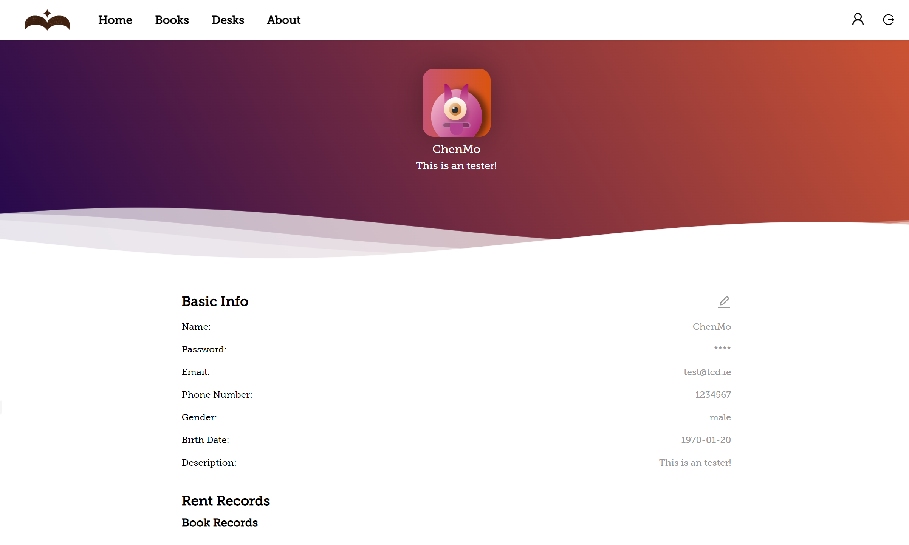

# Virtual-Library

## Description

This is a final project for the 2022 TCD University ASE (Advanced Software Engineering). The subject of the project is to design a virtual library, which aims to enable VR users to use VR devices for an immersive reading experience. 

This project is part of the web page. 

## Features

- Registration 
- Login
- Avatar Modify
- User Information Modify
- User Model Preview and Modify
- Seat Reservation and Check
- Book Reservation and Check
- Book Comment and Delete
- Book Recommend

## Tech Stack

- React @18.2.0
- React-redux @8.0.5
- React-router-dom @6.8.1
- antd @5.1.0
- tailwindcss
- firebase
- craco
- faker-js
- prettier

## Installation

To install this project, simply clone the repository and run `npm install` to install the necessary dependencies.

- Clone

  ```cmd
  https://github.com/Virtual-Library-ASE/Front-end.git
  ```

- Install dependencies

  ```cmd
  cd Front-end
  
  npm install
  ```

- Start

  Because [craco](https://github.com/dilanx/craco) is used to encapsulate css for components, it needs to be started with the [craco](https://github.com/dilanx/craco) command:

  ```cmd
  craco start
  ```

- Build

  ```cmd
  craco build
  ```

- Test

  ```test
  craco test
  ```

- Deploy

  ```cmd
  craco deploy
  ```

## Contributing

Contributions are welcome! Please feel free to submit a pull request or open an issue if you find a bug or have a suggestion for a new feature.

## License

This project is licensed under the MIT License.

## Screenshots



